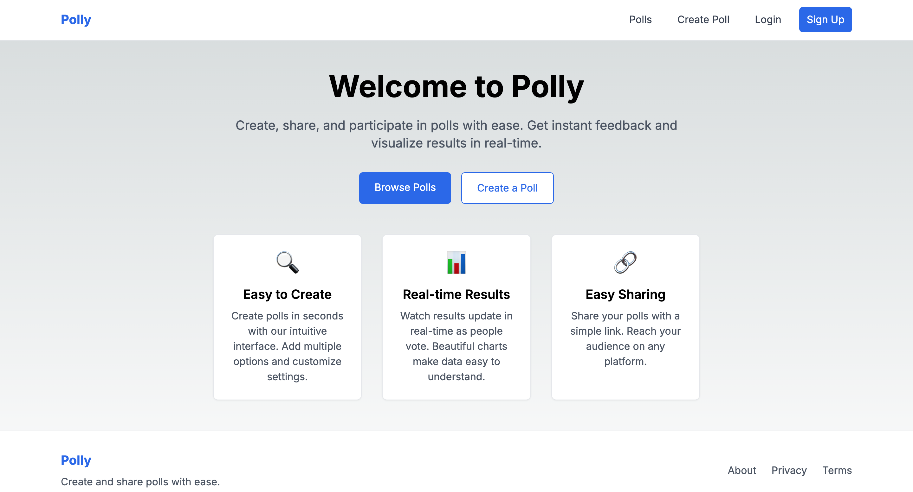
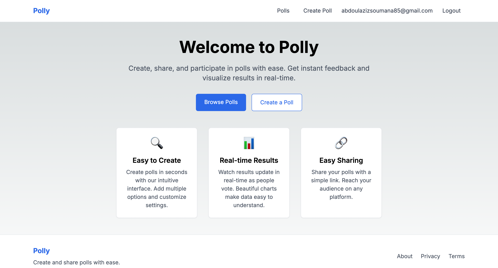
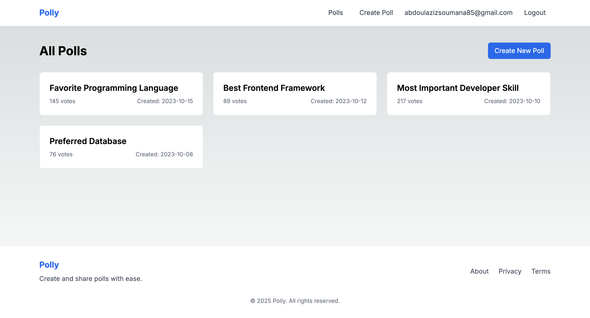
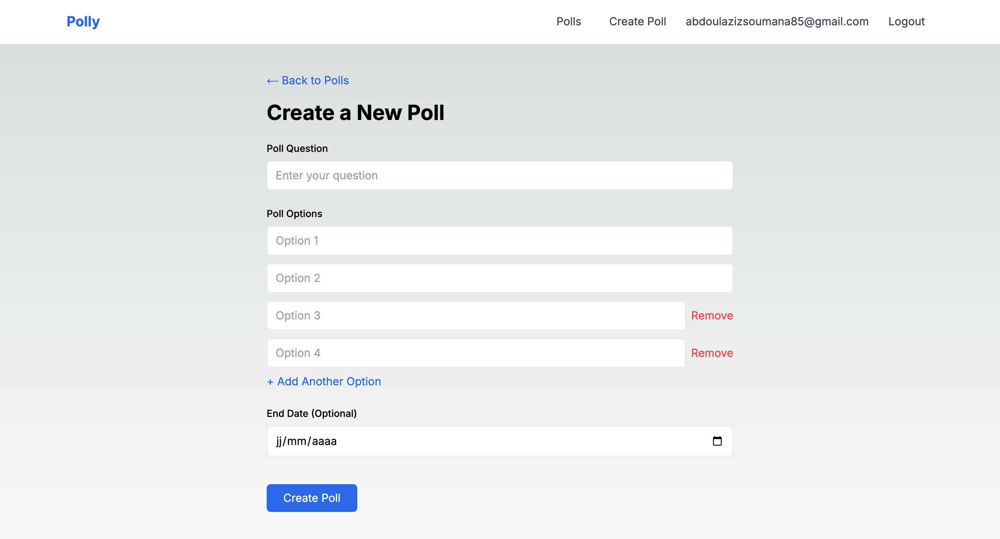
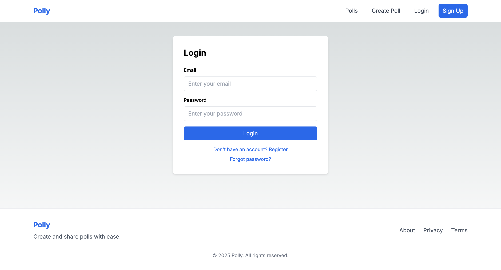

# Polly - Interactive Polling Application

## Project Overview

Polly is a modern, interactive polling application that allows users to create, share, and vote on polls. Built with a focus on user experience and real-time updates, Polly makes gathering opinions and feedback simple and engaging.

### Tech Stack

- **Frontend**: Next.js 14 (App Router), React, TypeScript, Tailwind CSS
- **Backend**: Next.js API Routes, Supabase (PostgreSQL)
- **Authentication**: Supabase Auth
- **Form Handling**: React Hook Form with Zod validation
- **UI Components**: Custom components with Tailwind CSS

## Screenshots







## Setup and Installation

### Prerequisites

- Node.js 18+ and npm
- Supabase account (free tier works fine)

### Environment Setup

1. Clone the repository:
   ```bash
   git clone https://github.com/yourusername/polly.git
   cd polly
   ```

2. Install dependencies:
   ```bash
   npm install
   ```

3. Create a `.env.local` file in the root directory with the following variables:
   ```
   NEXT_PUBLIC_SUPABASE_URL=your_supabase_url
   NEXT_PUBLIC_SUPABASE_ANON_KEY=your_supabase_anon_key
   ```

### Supabase Configuration

1. Create a new Supabase project
2. Set up the database schema using the SQL in `src/lib/db.sql`
3. Configure Row Level Security (RLS) policies as defined in the SQL file
4. Enable Email/Password authentication in the Auth settings

## Running Locally

1. Start the development server:
   ```bash
   npm run dev
   ```

2. Open [http://localhost:3000](http://localhost:3000) in your browser

## Usage Examples

### Creating a Poll

1. Sign up or log in to your account
2. Navigate to "Create Poll" from the navigation menu
3. Enter your poll question
4. Add at least two options (you can add up to 10)
5. Optionally set an end date
6. Click "Create Poll"

### Voting on a Poll

1. Browse available polls on the homepage or via direct link
2. Review the poll question and available options
3. Click on your preferred option
4. Click "Vote Now" to submit your vote
5. View real-time results showing how others have voted

## Testing

Run the test suite with:

```bash
npm test
```

For end-to-end tests:

```bash
npm run test:e2e
```

## Project Structure

- `/app` - Next.js app router pages and API routes
- `/components` - Reusable UI components
- `/context` - React context providers (Auth)
- `/lib` - Utility functions, types, and database repositories
  - `/repositories` - Database access layer
  - `/types` - TypeScript type definitions
  - `/validations` - Zod validation schemas

## Learn More

To learn more about the technologies used in this project:

- [Next.js Documentation](https://nextjs.org/docs)
- [Supabase Documentation](https://supabase.io/docs)
- [React Hook Form](https://react-hook-form.com/)
- [Zod Validation](https://github.com/colinhacks/zod)
- [Tailwind CSS](https://tailwindcss.com/docs)
